# Design Specification Document
## NWSDB Water & Wastewater Utility Asset Management and CMMS Platform

**Document Type:** System Design Specification (SDS) / Data Flow Diagram (DFD) Document
**Status:** Revised — re-scoped to `SRS.md` v2.0 (ISO 55000-aligned, FR-01–FR-34, NFR-01–NFR-12)
**Companion document:** `SRS.md` (Software Requirements Specification)
**Target stack:** Laravel 13 (backend/API) · MySQL 9.7 (database) · Inertia.js 3 · React 19 · TypeScript (frontend)

> **Revision note (this pass):** This revision removes every process, actor, data store, controller, route, and workflow related to **Plant & Operations recording, Lab Water Quality, and Energy/Telemetry (MQTT/InfluxDB/SCADA display)**, since these are out of scope for the ISO 55000 asset-management/CMMS platform described in the SRS. In their place, four new first-class functional areas have been added end-to-end (context diagram → Level 1 → Level 2 → data stores → routes → business rules → security roles): **Asset Acquisition**, **Asset Financing**, **Asset Auditing**, and **Asset Disposal**. The technology stack has also been updated from the legacy Laravel 10 + Blade/Vue 3 stack to the target **Laravel 13 + MySQL 9.7 + Inertia.js 3 + React 19 + TypeScript** stack, while explicitly preserving backward compatibility with the legacy `categories` nested-set table and related legacy columns during transition (see §8.4).

---

## Table of Contents
1. [Introduction](#1-introduction)
2. [System Overview](#2-system-overview)
3. [Architecture Design](#3-architecture-design)
4. [Data Flow Diagrams (DFD)](#4-data-flow-diagrams-dfd)
5. [Use Case Diagram](#5-use-case-diagram)
6. [Activity Diagrams](#6-activity-diagrams)
7. [Technology Stack](#7-technology-stack)
8. [Database Design](#8-database-design)
9. [Route Design](#9-route-design)
10. [Business Logic & Workflows](#10-business-logic--workflows)
11. [Security Design](#11-security-design)
12. [Testing Strategy](#12-testing-strategy)
13. [Summary](#13-summary)

---

## 1. Introduction

### 1.1 Purpose
This document describes **how** the NWSDB Asset Management / CMMS platform is built — its architecture, data flow, database design, routes, business workflows, security model, and testing approach — in direct alignment with `SRS.md`. Where the SRS answers *"what does the system do?"*, this document answers *"how is it built, and how do the pieces fit together?"*

### 1.2 Scope
The document covers the full re-scoped application:

- **In scope:** User & Administration Management, Asset Acquisition, Asset Management (register, categories, classifications, locations, GIS), Work Orders & Maintenance, Stock/Materials, Analytics & Reporting, **Asset Financing**, **Asset Auditing**, and **Asset Disposal**.
- **Out of scope (removed in this revision):** Plant & Operations recording (water quality operational readings, jar tests, chemical concentration balance, power failures, customer complaints), Lab Water Quality (basic/heavy-metal/TOC-THM/Church Hill testing), and Energy/Telemetry (MQTT gauges, InfluxDB queries, SCADA/solar dashboards, energy trend reports).

### 1.3 Audience
Developers, QA engineers, system architects, DevOps, finance/audit stakeholders, and project sponsors who need a single reference for the redesigned system.

### 1.4 How This Document Was Produced
This revision is derived from two inputs: (1) the finalized `SRS.md` (functional requirements FR-01–FR-34, non-functional requirements NFR-01–NFR-12, stakeholders, ISO 55000 lifecycle mapping), and (2) the existing Laravel codebase (`routes/web.php`, `app/Http/Controllers/Asset/**`, `app/Http/Controllers/PDF/**`) used to identify which existing processes and data stores must be **carried forward** (Asset, Work Order, Stock, Analytics) versus **removed** (Operations, Lab, Energy) versus **newly introduced** (Acquisition, Finance, Audit, Disposal) to match the SRS.

---

## 2. System Overview

The system is re-scoped from a multi-domain utility platform into a **focused ISO 55000-aligned Asset Management / CMMS platform**, serving corporate, regional, and site organizational levels from a single Laravel 13 codebase and a single MySQL 9.7 database.

| Aspect | Detail |
|---|---|
| Backend framework | **Laravel 13** (PHP 8.3+) |
| Frontend | **Inertia.js 3** + **React 19** + **TypeScript**, Tailwind CSS |
| Database | **MySQL 9.7** (native `GEOMETRY`/spatial types, spatial indexes) |
| Cache / Queue | Redis (application cache, queued jobs — notifications, depreciation runs, report generation) |
| Auth | Laravel session/Sanctum auth + role/permission-based access control (RBAC) |
| Background jobs | Laravel Scheduler — monthly depreciation runs, audit due-date reminders, PPM (preventive maintenance) generation, notification dispatch |
| Notifications | SMS / Email / WhatsApp channels via Laravel Notifications (NFR-12 in-app chat also supported) |
| PDF/Export | PDF and CSV/XLS export libraries (asset, finance, audit, disposal, and work-order reports) |
| GIS | Native MySQL spatial columns (`POINT`, `LINESTRING`, `POLYGON`, SRID 4326) rendered on a web map (e.g., Leaflet/MapLibre via React) |

**Core idea:** almost every request flows `Browser (React/Inertia) → routes/web.php → Controller → Model (Eloquent) → MySQL`, with two side-processes that are new to this revision: a **financial depreciation engine** (scheduled job → asset finance ledger) and a **multi-tier approval engine** (request → recommendation → approval) shared by both the **Asset Deletion** (FR-08) and **Asset Disposal** (FR-09, FR-34) workflows.

### 2.1 Functional Modules (Revised)

1. **Admin** — Users, Employees, Roles/Permissions, Events, Files, Profile *(unchanged)*
2. **Asset Acquisition** *(NEW)* — Procurement intake, unique utility asset ID generation, GIS registration (point/line/polygon), QR code generation, initial capitalization handoff to Finance
3. **Asset Management** — Assets, asset categories, ISO 55000 classifications (L1–L8), locations, files, measurement parameters, maintenance schedules *(unchanged, extended with classification hierarchy)*
4. **Work Orders & Maintenance** — Work order lifecycle, scheduled/preventive/corrective maintenance, tasks, personnel, parts, meters, notes, calendar *(unchanged)*
5. **Stock & Materials** — Stock codes, stock issue/receipt, work-order part consumption *(unchanged)*
6. **Asset Financing** *(NEW)* — Initial value capture, depreciation (CRC/DRC), current book value, financial charts/exports at corporate/regional/site level
7. **Asset Auditing** *(NEW)* — Scheduled/ad-hoc audits, condition scoring, risk scoring, engineering/financial audit findings, audit charts/exports
8. **Asset Disposal** *(NEW)* — Request → recommendation → approval disposal workflow, disposal methods, write-off posting back to Finance
9. **Analytics & Reporting** — Cross-module dashboards, charts, PDF/CSV/XLS exports covering engineering, cost, risk, financial, and audit data *(unchanged in mechanism, expanded in data sources)*

**Removed modules:** ~~Operations (Oper)~~, ~~Lab~~, ~~Energy/Telemetry~~ — all controllers, routes, data stores, and dashboards for these are decommissioned in this revision (see §9.4 for the explicit removal list).

---

## 3. Architecture Design

### 3.1 High-Level Architecture

The application keeps Laravel's **MVC** pattern with domain-based module folders, but the presentation layer moves from Blade+Vue to **Inertia.js 3 + React 19 + TypeScript**, and four new domain folders are introduced: `app/Asset/Acquisition`, `app/Asset/Finance`, `app/Asset/Audit`, `app/Asset/Disposal`.

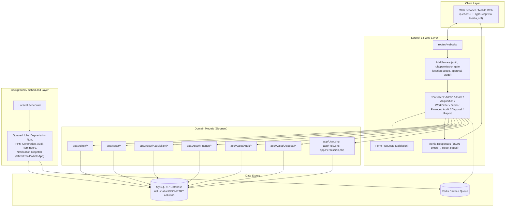
```mermaid
flowchart TB
    subgraph Client["Client Layer"]
        Browser["Web Browser / Mobile Web<br/>(React 19 + TypeScript via Inertia.js 3)"]
    end

    subgraph Web["Laravel 13 Web Layer"]
        Routes["routes/web.php"]
        MW["Middleware (auth, role/permission gate,<br/>location-scope, approval-stage)"]
        Ctrl["Controllers: Admin / Asset / Acquisition /<br/>WorkOrder / Stock / Finance / Audit / Disposal / Report"]
        Req["Form Requests (validation)"]
        InertiaResp["Inertia Responses (JSON props → React pages)"]
    end

    subgraph Domain["Domain Models (Eloquent)"]
        AdminM["app/Admin/*"]
        AssetM["app/Asset/*"]
        AcqM["app/Asset/Acquisition/*"]
        FinM["app/Asset/Finance/*"]
        AudM["app/Asset/Audit/*"]
        DispM["app/Asset/Disposal/*"]
        UserM["app/User.php, app/Role.php, app/Permission.php"]
    end

    subgraph Data["Data Stores"]
        MySQL[("MySQL 9.7 Database<br/>incl. spatial GEOMETRY columns")]
        Redis[("Redis Cache / Queue")]
    end

    subgraph Background["Background / Scheduled Layer"]
        Scheduler["Laravel Scheduler"]
        Jobs["Queued Jobs: Depreciation Run,<br/>PPM Generation, Audit Reminders,<br/>Notification Dispatch (SMS/Email/WhatsApp)"]
    end

    Browser <--> Routes
    Routes --> MW --> Ctrl
    Ctrl --> Req
    Ctrl --> InertiaResp --> Browser
    Ctrl --> AdminM
    Ctrl --> AssetM
    Ctrl --> AcqM
    Ctrl --> FinM
    Ctrl --> AudM
    Ctrl --> DispM
    Ctrl --> UserM
    AdminM --> MySQL
    AssetM --> MySQL
    AcqM --> MySQL
    FinM --> MySQL
    AudM --> MySQL
    DispM --> MySQL
    UserM --> MySQL
    Ctrl --> Redis
    Scheduler --> Jobs --> MySQL
    Jobs --> Redis
```

**Layer responsibilities**

| Layer | Responsibility | Example |
|---|---|---|
| Routing | Maps URLs to controller actions, applies middleware | `routes/web.php` |
| Middleware | Cross-cutting request checks (auth, RBAC gate, org-level scope, approval-stage guard) | `EnsureRole`, `EnsureOrgLevelScope`, `EnsureApprovalStage` |
| Controllers | Orchestrate validation, business rules, model calls, Inertia rendering | `Asset\DisposalController` |
| Form Requests | Input validation before controller logic runs | `AssetDisposalRequest`, `AssetFinanceRequest` |
| Models (Eloquent) | Represent DB tables, define relationships | `Asset`, `AssetClassification`, `AssetDisposal`, `AssetFinanceLedger` |
| Services | Encapsulate reusable business logic | `DepreciationService`, `ApprovalWorkflowService`, `QrCodeService`, `GisRegistrationService` |
| Jobs / Console Commands | Scheduled/background processing | `RunMonthlyDepreciation`, `GeneratePpmWorkOrders`, `AuditDueReminder` |
| React Pages (Inertia) | Present data, forms, dashboards, and GIS maps | `resources/js/Pages/Asset/**`, `resources/js/Pages/Finance/**` |

### 3.2 Module-to-Controller Map (Revised)

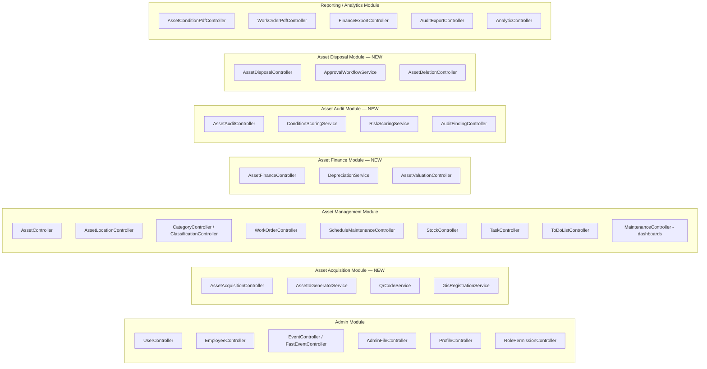
```mermaid
flowchart LR
    subgraph Admin_Module["Admin Module"]
        A1[UserController]
        A2[EmployeeController]
        A3[EventController / FastEventController]
        A4[AdminFileController]
        A5[ProfileController]
        A6[RolePermissionController]
    end

    subgraph Acquisition_Module["Asset Acquisition Module — NEW"]
        Q1[AssetAcquisitionController]
        Q2[AssetIdGeneratorService]
        Q3[QrCodeService]
        Q4[GisRegistrationService]
    end

    subgraph Asset_Module["Asset Management Module"]
        B1[AssetController]
        B2[AssetLocationController]
        B3[CategoryController / ClassificationController]
        B4[WorkOrderController]
        B5[ScheduleMaintenanceController]
        B6[StockController]
        B7[TaskController]
        B8[ToDoListController]
        B9[MaintenanceController - dashboards]
    end

    subgraph Finance_Module["Asset Finance Module — NEW"]
        F1[AssetFinanceController]
        F2[DepreciationService]
        F3[AssetValuationController]
    end

    subgraph Audit_Module["Asset Audit Module — NEW"]
        U1[AssetAuditController]
        U2[ConditionScoringService]
        U3[RiskScoringService]
        U4[AuditFindingController]
    end

    subgraph Disposal_Module["Asset Disposal Module — NEW"]
        D1[AssetDisposalController]
        D2[ApprovalWorkflowService]
        D3[AssetDeletionController]
    end

    subgraph Reporting_Module["Reporting / Analytics Module"]
        R1[AssetConditionPdfController]
        R2[WorkOrderPdfController]
        R3[FinanceExportController]
        R4[AuditExportController]
        R5[AnalyticController]
    end
```

---

## 4. Data Flow Diagrams (DFD)

A **Data Flow Diagram** shows how data moves through the system — who sends data in, what processes act on it, where it's stored, and what comes out. These are written to be understandable without a technical background.

### 4.1 DFD Context Diagram (Level 0) — "The Whole System as One Box"

Level 0 treats the entire application as a single process and shows only the external parties (actors) that send or receive data. Actor names follow the stakeholder table in `SRS.md` §5.

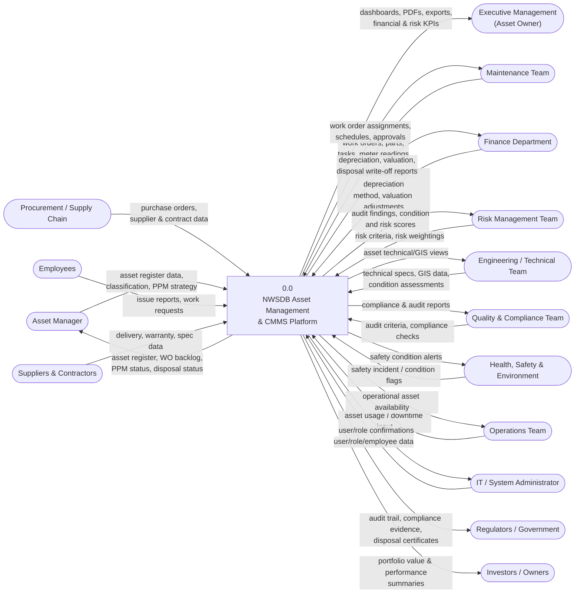
```mermaid
flowchart LR
    ExecMgmt(["Executive Management<br/>(Asset Owner)"])
    AssetMgr(["Asset Manager"])
    OpsTeam(["Operations Team"])
    MaintTeam(["Maintenance Team"])
    Finance(["Finance Department"])
    RiskTeam(["Risk Management Team"])
    Engineering(["Engineering / Technical Team"])
    Procurement(["Procurement / Supply Chain"])
    Quality(["Quality & Compliance Team"])
    HSE(["Health, Safety & Environment"])
    ITAdmin(["IT / System Administrator"])
    Employees(["Employees"])
    Suppliers(["Suppliers & Contractors"])
    Regulators(["Regulators / Government"])
    Investors(["Investors / Owners"])

    System["0.0<br/>NWSDB Asset Management<br/>& CMMS Platform"]

    ITAdmin -- "user/role/employee data" --> System
    Procurement -- "purchase orders,<br/>supplier & contract data" --> System
    AssetMgr -- "asset register data,<br/>classification, PPM strategy" --> System
    Engineering -- "technical specs, GIS data,<br/>condition assessments" --> System
    MaintTeam -- "work orders, parts,<br/>tasks, meter readings" --> System
    Finance -- "acquisition cost, depreciation<br/>method, valuation adjustments" --> System
    RiskTeam -- "risk criteria, risk weightings" --> System
    Quality -- "audit criteria, compliance checks" --> System
    HSE -- "safety incident / condition flags" --> System
    OpsTeam -- "asset usage / downtime input" --> System
    Employees -- "issue reports, work requests" --> System
    Suppliers -- "delivery, warranty, spec data" --> System

    System -- "dashboards, PDFs, exports,<br/>financial & risk KPIs" --> ExecMgmt
    System -- "asset register, WO backlog,<br/>PPM status, disposal status" --> AssetMgr
    System -- "work order assignments,<br/>schedules, approvals" --> MaintTeam
    System -- "depreciation, valuation,<br/>disposal write-off reports" --> Finance
    System -- "audit findings, condition<br/>and risk scores" --> RiskTeam
    System -- "asset technical/GIS views" --> Engineering
    System -- "compliance & audit reports" --> Quality
    System -- "safety condition alerts" --> HSE
    System -- "operational asset availability" --> OpsTeam
    System -- "user/role confirmations" --> ITAdmin
    System -- "audit trail, compliance evidence,<br/>disposal certificates" --> Regulators
    System -- "portfolio value & performance<br/>summaries" --> Investors
```

### 4.2 DFD Level 1 — Major Process Breakdown

Level 1 opens the single "System" box into the major functional processes. Each process maps one-to-one onto the SRS §6 functional-requirement groupings, so process `N.0` below always corresponds to SRS §6.N.

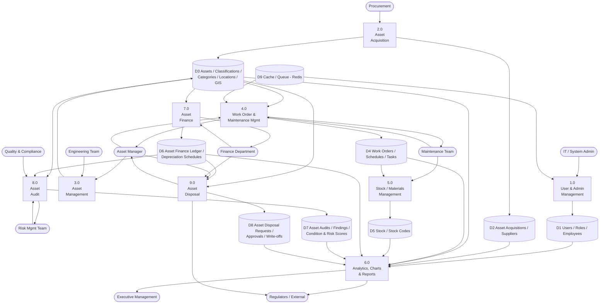
```mermaid
flowchart TB
    ITAdmin(["IT / System Admin"])
    Procurement(["Procurement"])
    AssetMgr(["Asset Manager"])
    Engineering(["Engineering Team"])
    MaintTeam(["Maintenance Team"])
    Finance(["Finance Department"])
    RiskTeam(["Risk Mgmt Team"])
    Quality(["Quality & Compliance"])
    ExecMgmt(["Executive Management"])
    Regulators(["Regulators / External"])

    P1["1.0<br/>User & Admin<br/>Management"]
    P2["2.0<br/>Asset<br/>Acquisition"]
    P3["3.0<br/>Asset<br/>Management"]
    P4["4.0<br/>Work Order &<br/>Maintenance Mgmt"]
    P5["5.0<br/>Stock / Materials<br/>Management"]
    P6["6.0<br/>Analytics, Charts<br/>& Reports"]
    P7["7.0<br/>Asset<br/>Finance"]
    P8["8.0<br/>Asset<br/>Audit"]
    P9["9.0<br/>Asset<br/>Disposal"]

    DS1[("D1 Users / Roles / Employees")]
    DS2[("D2 Asset Acquisitions / Suppliers")]
    DS3[("D3 Assets / Classifications /<br/>Categories / Locations / GIS")]
    DS4[("D4 Work Orders / Schedules / Tasks")]
    DS5[("D5 Stock / Stock Codes")]
    DS6[("D6 Asset Finance Ledger /<br/>Depreciation Schedules")]
    DS7[("D7 Asset Audits / Findings /<br/>Condition & Risk Scores")]
    DS8[("D8 Asset Disposal Requests /<br/>Approvals / Write-offs")]
    DS9[("D9 Cache / Queue - Redis")]

    ITAdmin --> P1 --> DS1
    Procurement --> P2 --> DS2
    P2 --> DS3
    AssetMgr --> P3 --> DS3
    Engineering --> P3
    DS3 --> P4
    MaintTeam --> P4 --> DS4
    AssetMgr --> P4
    MaintTeam --> P5 --> DS5
    DS4 --> P5

    DS3 --> P7
    Finance --> P7 --> DS6

    DS3 --> P8
    DS6 --> P8
    RiskTeam --> P8 --> DS7
    Quality --> P8

    DS3 --> P9
    DS6 --> P9
    AssetMgr --> P9 --> DS8
    Finance --> P9

    DS1 --> P6
    DS2 --> P6
    DS3 --> P6
    DS4 --> P6
    DS5 --> P6
    DS6 --> P6
    DS7 --> P6
    DS8 --> P6
    DS9 --> P1
    DS9 --> P4

    P6 --> ExecMgmt
    P6 --> Regulators
    P4 --> MaintTeam
    P4 --> AssetMgr
    P7 --> Finance
    P8 --> RiskTeam
    P9 --> AssetMgr
    P9 --> Regulators
```

**Process descriptions**

| Process | Description | Key controllers/services | SRS FR reference |
|---|---|---|---|
| 1.0 User & Admin Management | User accounts, roles/permissions, employees, calendar events, admin files | `UserController`, `EmployeeController`, `EventController`, `RolePermissionController` | FR-01–FR-07 (§6.1) |
| 2.0 Asset Acquisition **(NEW)** | Intake new assets from procurement, generate unique utility asset ID, GIS geometry capture, QR code generation | `AssetAcquisitionController`, `AssetIdGeneratorService`, `QrCodeService`, `GisRegistrationService` | FR-10–FR-13 (§6.2) |
| 3.0 Asset Management | Register/edit assets, categories, ISO 55000 classifications, locations, files, measurements, PPM schedules | `AssetController`, `CategoryController`, `ClassificationController`, `AssetLocationController` | FR-14–FR-20 (§6.3) |
| 4.0 Work Order & Maintenance Management | Create/approve/close work orders, PPM scheduling, tasks, personnel, parts, meters, notes, calendar | `WorkOrderController`, `ScheduleMaintenanceController`, `TaskController` | FR-21–FR-27 (§6.4) |
| 5.0 Stock / Materials Management | Track spare parts and stock codes issued against work orders | `StockController` | FR-28–FR-30 (§6.5) |
| 6.0 Analytics, Charts & Reports | Cross-module dashboards, cost/risk/health analytics, PDF/CSV/XLS exports | `AnalyticController`, `*ExportController`, `*PdfController` | FR-31 (§6.6) |
| 7.0 Asset Finance **(NEW)** | Capture initial value, run depreciation (CRC/DRC), maintain current book value, financial charts/exports | `AssetFinanceController`, `DepreciationService`, `AssetValuationController` | FR-32 (§6.7) |
| 8.0 Asset Audit **(NEW)** | Schedule/perform audits, score condition and risk, record findings, audit charts/exports | `AssetAuditController`, `ConditionScoringService`, `RiskScoringService` | FR-33 (§6.8) |
| 9.0 Asset Disposal **(NEW)** | Multi-tier request → recommendation → approval disposal workflow, write-off posting | `AssetDisposalController`, `ApprovalWorkflowService`, `AssetDeletionController` | FR-08, FR-09, FR-34 (§6.1, §6.9) |

**Removed processes (were 5.0–7.0 in the prior revision):** ~~Plant Operations Recording~~, ~~Lab Water Quality Recording~~, ~~Energy & Telemetry Collection~~ — no longer part of this system's scope.

### 4.3 DFD Level 2 — Process 2.0 "Asset Acquisition" Expanded (NEW)

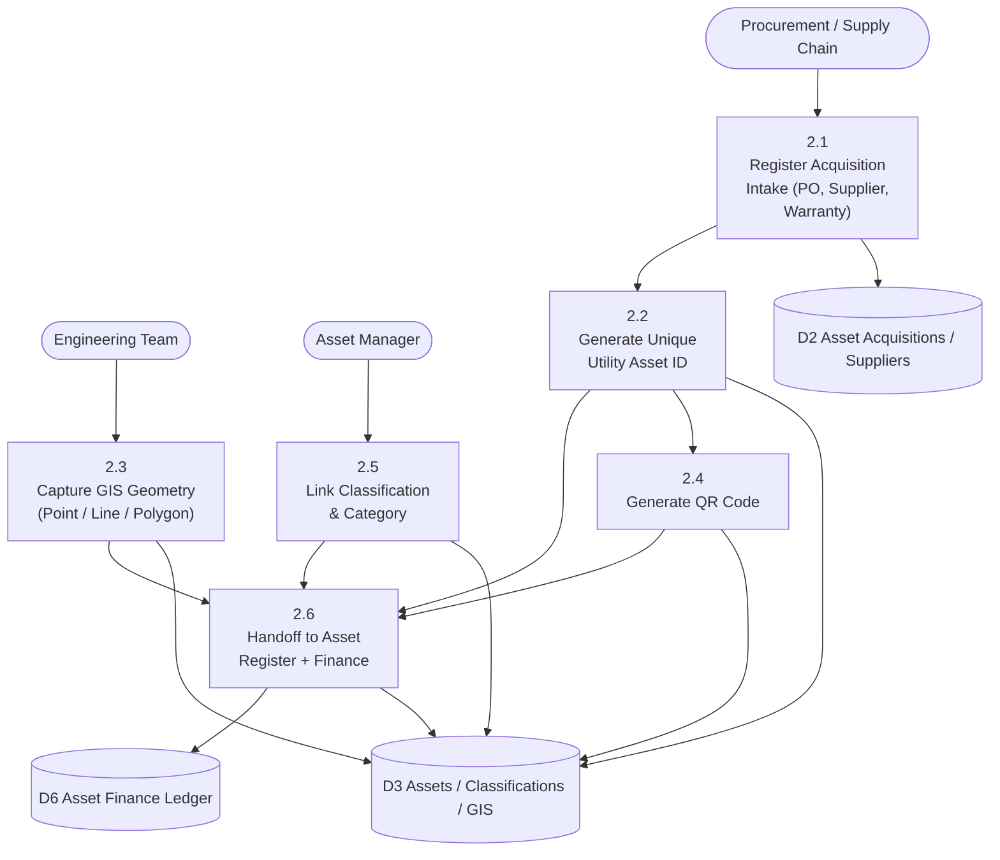
```mermaid
flowchart TB
    Procurement(["Procurement / Supply Chain"])
    Engineering(["Engineering Team"])
    AssetMgr(["Asset Manager"])

    P2_1["2.1<br/>Register Acquisition<br/>Intake (PO, Supplier,<br/>Warranty)"]
    P2_2["2.2<br/>Generate Unique<br/>Utility Asset ID"]
    P2_3["2.3<br/>Capture GIS Geometry<br/>(Point / Line / Polygon)"]
    P2_4["2.4<br/>Generate QR Code"]
    P2_5["2.5<br/>Link Classification<br/>& Category"]
    P2_6["2.6<br/>Handoff to Asset<br/>Register + Finance"]

    DS2[("D2 Asset Acquisitions / Suppliers")]
    DS3[("D3 Assets / Classifications / GIS")]
    DS6[("D6 Asset Finance Ledger")]

    Procurement --> P2_1 --> DS2
    P2_1 --> P2_2
    P2_2 --> DS3
    Engineering --> P2_3 --> DS3
    P2_2 --> P2_4 --> DS3
    AssetMgr --> P2_5 --> DS3
    P2_2 --> P2_6
    P2_3 --> P2_6
    P2_4 --> P2_6
    P2_5 --> P2_6
    P2_6 --> DS3
    P2_6 --> DS6
```

**Sub-process to FR mapping:** 2.1↔FR-10, 2.2↔FR-10, 2.3↔FR-11/FR-12, 2.4↔FR-13, 2.5↔FR-11, 2.6↔FR-10/FR-32 (initial value handed to Finance).

### 4.4 DFD Level 2 — Process 4.0 "Work Order & Maintenance Management" Expanded

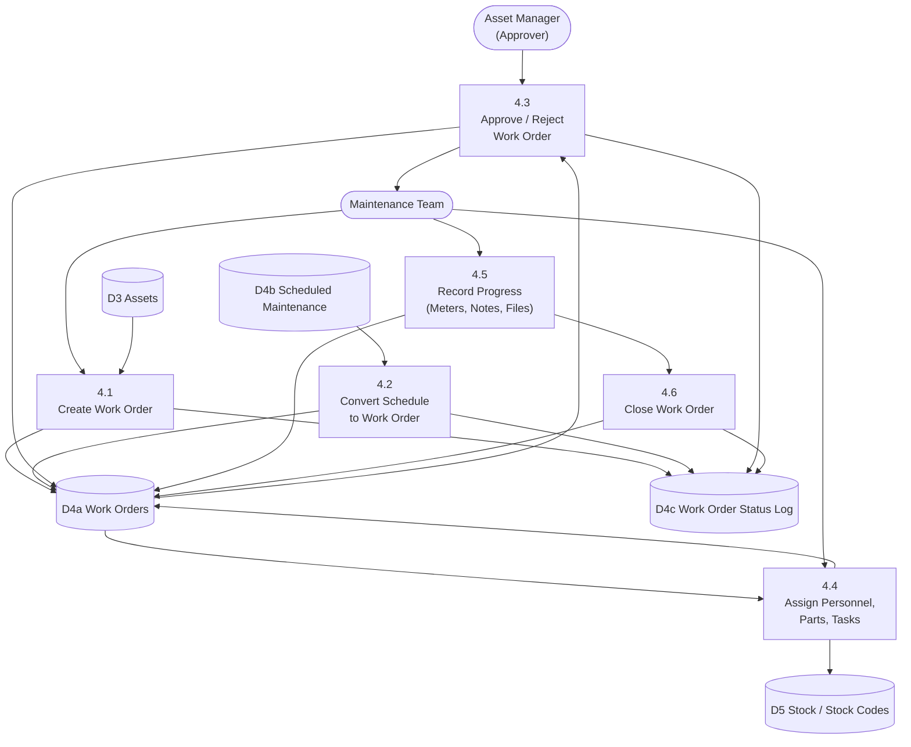
```mermaid
flowchart TB
    AssetMgr(["Asset Manager<br/>(Approver)"])
    MaintTeam(["Maintenance Team"])

    P4_1["4.1<br/>Create Work Order"]
    P4_2["4.2<br/>Convert Schedule<br/>to Work Order"]
    P4_3["4.3<br/>Approve / Reject<br/>Work Order"]
    P4_4["4.4<br/>Assign Personnel,<br/>Parts, Tasks"]
    P4_5["4.5<br/>Record Progress<br/>(Meters, Notes, Files)"]
    P4_6["4.6<br/>Close Work Order"]

    DS3[("D3 Assets")]
    DS4a[("D4a Work Orders")]
    DS4b[("D4b Scheduled Maintenance")]
    DS4c[("D4c Work Order Status Log")]
    DS5[("D5 Stock / Stock Codes")]

    MaintTeam --> P4_1
    DS3 --> P4_1
    P4_1 --> DS4a
    P4_1 --> DS4c

    DS4b --> P4_2
    P4_2 --> DS4a
    P4_2 --> DS4c

    DS4a --> P4_3
    AssetMgr --> P4_3
    P4_3 --> DS4a
    P4_3 --> DS4c
    P4_3 --> MaintTeam

    DS4a --> P4_4
    MaintTeam --> P4_4
    P4_4 --> DS4a
    P4_4 --> DS5

    MaintTeam --> P4_5
    P4_5 --> DS4a

    P4_5 --> P4_6
    P4_6 --> DS4a
    P4_6 --> DS4c
```

**Sub-process to FR mapping:** 4.1↔FR-21, 4.2↔FR-22, 4.3↔FR-21/FR-25, 4.4↔FR-23, 4.5↔FR-23/FR-25, 4.6↔FR-21/FR-25/FR-27.

### 4.5 DFD Level 2 — Process 7.0 "Asset Finance" Expanded (NEW)

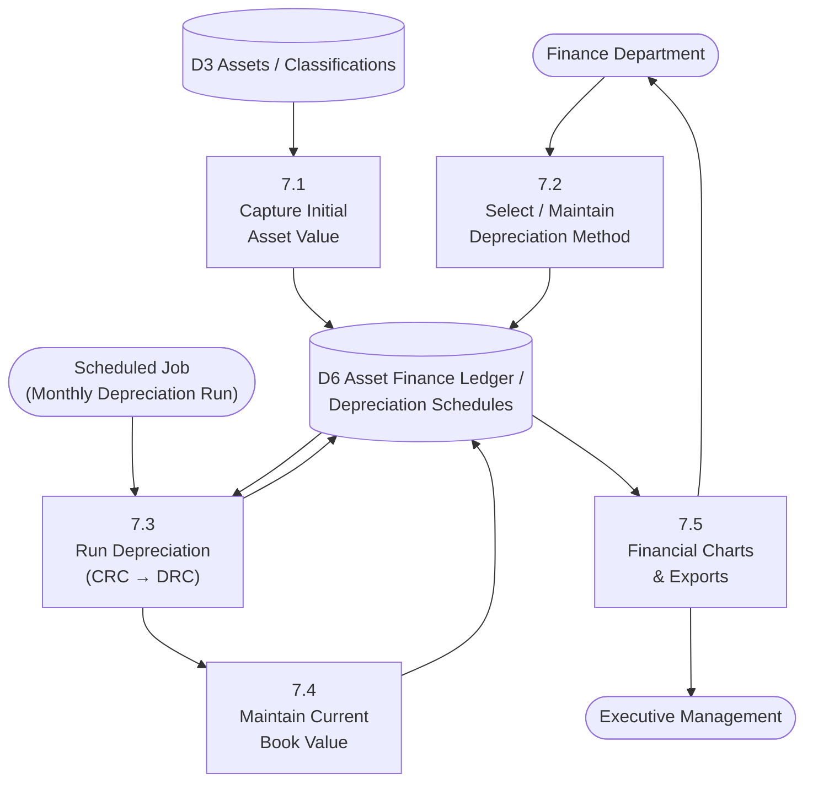
```mermaid
flowchart TB
    Finance(["Finance Department"])
    ExecMgmt(["Executive Management"])
    Scheduler(["Scheduled Job<br/>(Monthly Depreciation Run)"])

    P7_1["7.1<br/>Capture Initial<br/>Asset Value"]
    P7_2["7.2<br/>Select / Maintain<br/>Depreciation Method"]
    P7_3["7.3<br/>Run Depreciation<br/>(CRC → DRC)"]
    P7_4["7.4<br/>Maintain Current<br/>Book Value"]
    P7_5["7.5<br/>Financial Charts<br/>& Exports"]

    DS3[("D3 Assets / Classifications")]
    DS6[("D6 Asset Finance Ledger /<br/>Depreciation Schedules")]

    DS3 --> P7_1 --> DS6
    Finance --> P7_2 --> DS6
    Scheduler --> P7_3
    DS6 --> P7_3
    P7_3 --> DS6
    P7_3 --> P7_4 --> DS6
    DS6 --> P7_5 --> Finance
    P7_5 --> ExecMgmt
```

**Sub-process to FR mapping:** 7.1–7.4↔FR-32 (initial value, depreciation, current balance), 7.5↔FR-31/FR-32 (financial analytics and exports at corporate/regional/site level).

**Business rule note:** Depreciation uses the **Current Replacement Cost (CRC)** and **Depreciated Replacement Cost (DRC)** model consistent with ISO 55000 practice — CRC is captured/updated at acquisition and re-valuation; DRC is derived monthly as `CRC − Accumulated Depreciation`, driven by each asset's ISO classification (L1–L8) default useful-life table, with per-asset overrides for `expected_life` / `Remaining Useful Life (RUL)`.

### 4.6 DFD Level 2 — Process 8.0 "Asset Audit" Expanded (NEW)

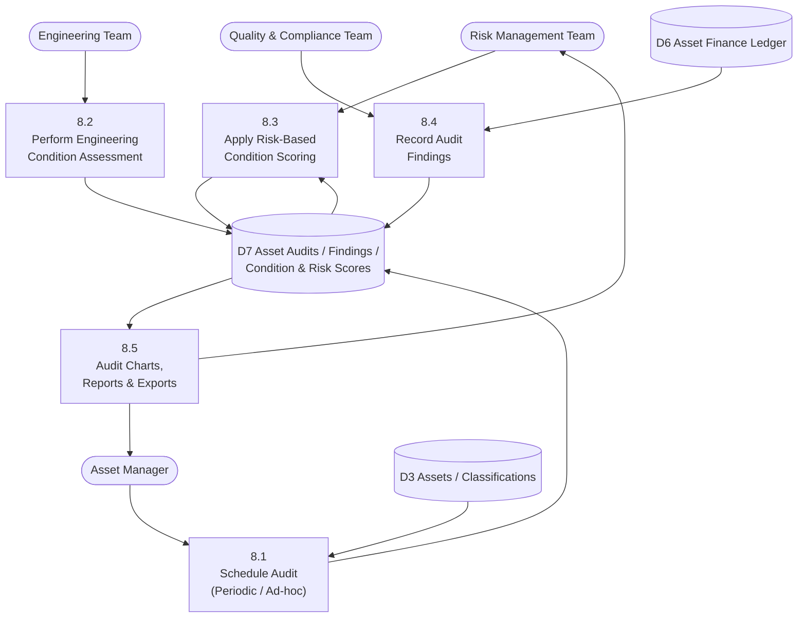
```mermaid
flowchart TB
    RiskTeam(["Risk Management Team"])
    Quality(["Quality & Compliance Team"])
    Engineering(["Engineering Team"])
    AssetMgr(["Asset Manager"])

    P8_1["8.1<br/>Schedule Audit<br/>(Periodic / Ad-hoc)"]
    P8_2["8.2<br/>Perform Engineering<br/>Condition Assessment"]
    P8_3["8.3<br/>Apply Risk-Based<br/>Condition Scoring"]
    P8_4["8.4<br/>Record Audit<br/>Findings"]
    P8_5["8.5<br/>Audit Charts,<br/>Reports & Exports"]

    DS3[("D3 Assets / Classifications")]
    DS6[("D6 Asset Finance Ledger")]
    DS7[("D7 Asset Audits / Findings /<br/>Condition & Risk Scores")]

    AssetMgr --> P8_1 --> DS7
    DS3 --> P8_1
    Engineering --> P8_2 --> DS7
    DS7 --> P8_3
    RiskTeam --> P8_3 --> DS7
    Quality --> P8_4 --> DS7
    DS6 --> P8_4
    DS7 --> P8_5 --> RiskTeam
    P8_5 --> AssetMgr
```

**Sub-process to FR mapping:** 8.1–8.4↔FR-33 (audit workflow, engineering/risk/financial data capture), 8.5↔FR-31/FR-33 (audit charts and exports at corporate/regional/site level).

**Business rule note:** Each audit produces a **condition score** (engineering/physical state) and a **risk score** (probability × consequence of failure, weighted by ISO asset classification criticality). The combined score feeds the "at-risk / unhealthy asset" watch-list referenced in `SRS.md` §2, and can trigger a recommendation to start the Asset Disposal workflow (Process 9.0) when an asset scores below the configured threshold.

### 4.7 DFD Level 2 — Process 9.0 "Asset Disposal" Expanded (NEW)

This process also implements the shared **request → recommendation → approval** workflow used for **Asset Deletion (FR-08)**, since FR-09 explicitly requires disposal to reuse the same controlled workflow.

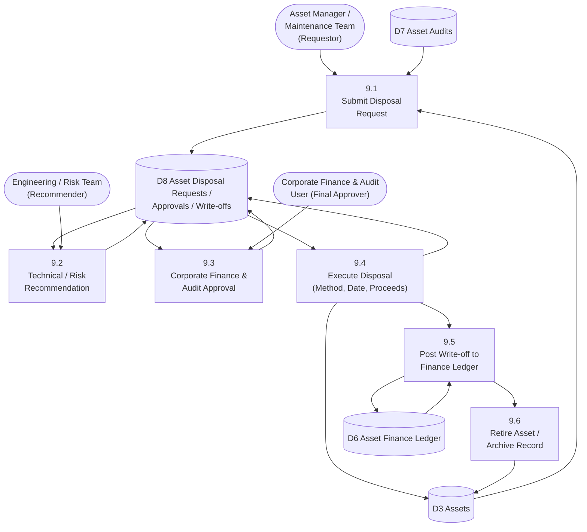
```mermaid
flowchart TB
    Requestor(["Asset Manager /<br/>Maintenance Team<br/>(Requestor)"])
    Recommender(["Engineering / Risk Team<br/>(Recommender)"])
    Approver(["Corporate Finance & Audit<br/>User (Final Approver)"])

    P9_1["9.1<br/>Submit Disposal<br/>Request"]
    P9_2["9.2<br/>Technical / Risk<br/>Recommendation"]
    P9_3["9.3<br/>Corporate Finance &<br/>Audit Approval"]
    P9_4["9.4<br/>Execute Disposal<br/>(Method, Date, Proceeds)"]
    P9_5["9.5<br/>Post Write-off to<br/>Finance Ledger"]
    P9_6["9.6<br/>Retire Asset /<br/>Archive Record"]

    DS3[("D3 Assets")]
    DS6[("D6 Asset Finance Ledger")]
    DS7[("D7 Asset Audits")]
    DS8[("D8 Asset Disposal Requests /<br/>Approvals / Write-offs")]

    Requestor --> P9_1
    DS3 --> P9_1
    DS7 --> P9_1
    P9_1 --> DS8

    DS8 --> P9_2
    Recommender --> P9_2
    P9_2 --> DS8

    DS8 --> P9_3
    Approver --> P9_3
    P9_3 --> DS8

    DS8 --> P9_4
    P9_4 --> DS3
    P9_4 --> DS8

    P9_4 --> P9_5
    DS6 --> P9_5
    P9_5 --> DS6

    P9_5 --> P9_6
    P9_6 --> DS3
```

**Sub-process to FR mapping:** 9.1↔FR-09/FR-34, 9.2↔FR-08/FR-09 (recommendation stage), 9.3↔FR-08/FR-09 (corporate-level finance & audit sign-off), 9.4–9.6↔FR-34.

### 4.8 DFD-to-FR Traceability Summary

| SRS FR range | SRS section | DFD process(es) |
|---|---|---|
| FR-01–FR-07 | §6.1 User Management | 1.0 |
| FR-08–FR-09 | §6.1 (deletion/disposal workflow) | 9.1–9.3 (shared approval engine) |
| FR-10–FR-13 | §6.2 Asset Acquisition | 2.0 (2.1–2.6) |
| FR-14–FR-20 | §6.3 Asset Management | 3.0 |
| FR-21–FR-27 | §6.4 Work Orders & Maintenance | 4.0 (4.1–4.6) |
| FR-28–FR-30 | §6.5 Stock & Materials | 5.0 |
| FR-31 | §6.6 Analytics, Charts, Exports, Reports | 6.0, plus 7.5 / 8.5 |
| FR-32 | §6.7 Asset Finance | 7.0 (7.1–7.5) |
| FR-33 | §6.8 Asset Audit | 8.0 (8.1–8.5) |
| FR-34 | §6.9 Asset Disposal | 9.0 (9.4–9.6) |

Every FR in the finalized SRS is represented in exactly one (or, for FR-08/FR-09/FR-31, more than one related) DFD process above — closing the traceability loop end-to-end.

---

## 5. Use Case Diagram

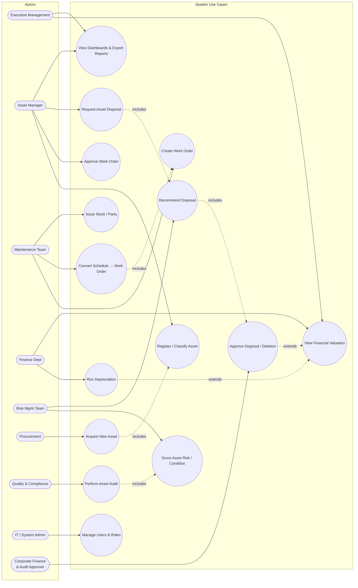
```mermaid
flowchart LR
    subgraph Actors
        ExecMgmt(["Executive Management"])
        AssetMgr(["Asset Manager"])
        MaintTeam(["Maintenance Team"])
        Finance(["Finance Dept"])
        RiskTeam(["Risk Mgmt Team"])
        Procurement(["Procurement"])
        Quality(["Quality & Compliance"])
        ITAdmin(["IT / System Admin"])
        CorpApprover(["Corporate Finance<br/>& Audit Approver"])
    end

    subgraph UseCases["System Use Cases"]
        UC1(("Manage Users & Roles"))
        UC2(("Acquire New Asset"))
        UC3(("Register / Classify Asset"))
        UC4(("Create Work Order"))
        UC5(("Approve Work Order"))
        UC6(("Convert Schedule → Work Order"))
        UC7(("Issue Stock / Parts"))
        UC8(("Run Depreciation"))
        UC9(("View Financial Valuation"))
        UC10(("Perform Asset Audit"))
        UC11(("Score Asset Risk / Condition"))
        UC12(("Request Asset Disposal"))
        UC13(("Recommend Disposal"))
        UC14(("Approve Disposal / Deletion"))
        UC15(("View Dashboards & Export Reports"))
    end

    ITAdmin --> UC1
    Procurement --> UC2
    AssetMgr --> UC3
    MaintTeam --> UC4
    AssetMgr --> UC5
    MaintTeam --> UC6
    MaintTeam --> UC7
    Finance --> UC8
    Finance --> UC9
    ExecMgmt --> UC9
    Quality --> UC10
    RiskTeam --> UC11
    AssetMgr --> UC12
    RiskTeam --> UC13
    CorpApprover --> UC14
    ExecMgmt --> UC15
    AssetMgr --> UC15

    UC2 -.->|includes| UC3
    UC6 -.->|includes| UC4
    UC12 -.->|includes| UC13
    UC13 -.->|includes| UC14
    UC8 -.->|extends| UC9
    UC10 -.->|includes| UC11
    UC14 -.->|extends| UC9
```

---

## 6. Activity Diagrams

### 6.1 Asset Acquisition Activity

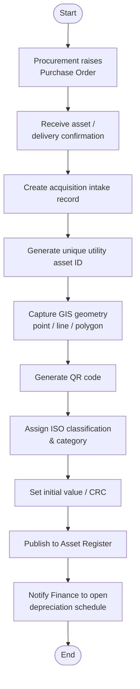
```mermaid
flowchart TD
    Start([Start]) --> A1[Procurement raises<br/>Purchase Order]
    A1 --> A2[Receive asset /<br/>delivery confirmation]
    A2 --> A3[Create acquisition intake record]
    A3 --> A4[Generate unique utility asset ID]
    A4 --> A5[Capture GIS geometry<br/>point / line / polygon]
    A5 --> A6[Generate QR code]
    A6 --> A7[Assign ISO classification<br/>& category]
    A7 --> A8[Set initial value / CRC]
    A8 --> A9[Publish to Asset Register]
    A9 --> A10[Notify Finance to open<br/>depreciation schedule]
    A10 --> End([End])
```

### 6.2 Depreciation Run Activity (Asset Finance)

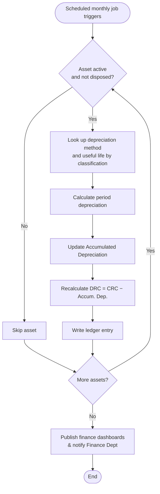
```mermaid
flowchart TD
    Start([Scheduled monthly job triggers]) --> B1{Asset active<br/>and not disposed?}
    B1 -- No --> Skip[Skip asset] --> Loop{More assets?}
    B1 -- Yes --> B2[Look up depreciation method<br/>and useful life by classification]
    B2 --> B3[Calculate period depreciation]
    B3 --> B4[Update Accumulated Depreciation]
    B4 --> B5[Recalculate DRC = CRC − Accum. Dep.]
    B5 --> B6[Write ledger entry]
    B6 --> Loop
    Loop -- Yes --> B1
    Loop -- No --> B7[Publish finance dashboards<br/>& notify Finance Dept]
    B7 --> End([End])
```

### 6.3 Asset Audit Activity

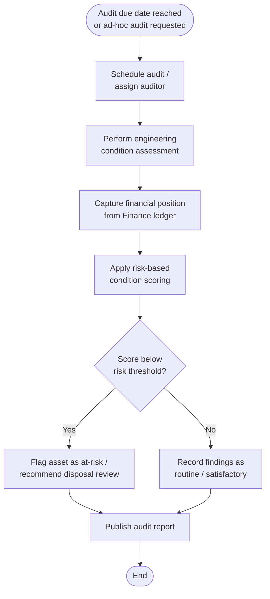
```mermaid
flowchart TD
    Start([Audit due date reached<br/>or ad-hoc audit requested]) --> C1[Schedule audit /<br/>assign auditor]
    C1 --> C2[Perform engineering<br/>condition assessment]
    C2 --> C3[Capture financial position<br/>from Finance ledger]
    C3 --> C4[Apply risk-based<br/>condition scoring]
    C4 --> C5{Score below<br/>risk threshold?}
    C5 -- Yes --> C6[Flag asset as at-risk /<br/>recommend disposal review]
    C5 -- No --> C7[Record findings as<br/>routine / satisfactory]
    C6 --> C8[Publish audit report]
    C7 --> C8
    C8 --> End([End])
```

### 6.4 Asset Disposal / Deletion Approval Activity (shared engine — FR-08/FR-09/FR-34)

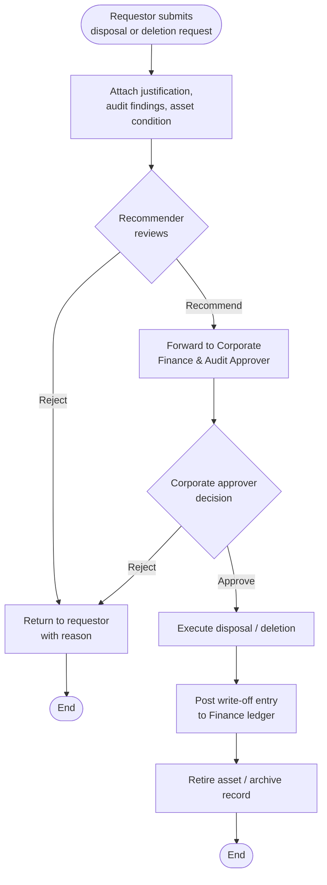
```mermaid
flowchart TD
    Start([Requestor submits<br/>disposal or deletion request]) --> D1[Attach justification,<br/>audit findings, asset condition]
    D1 --> D2{Recommender<br/>reviews}
    D2 -- Reject --> D3[Return to requestor<br/>with reason] --> End1([End])
    D2 -- Recommend --> D4[Forward to Corporate<br/>Finance & Audit Approver]
    D4 --> D5{Corporate approver<br/>decision}
    D5 -- Reject --> D3
    D5 -- Approve --> D6[Execute disposal / deletion]
    D6 --> D7[Post write-off entry<br/>to Finance ledger]
    D7 --> D8[Retire asset / archive record]
    D8 --> End2([End])
```

### 6.5 Work Order Lifecycle Activity (unchanged core logic)

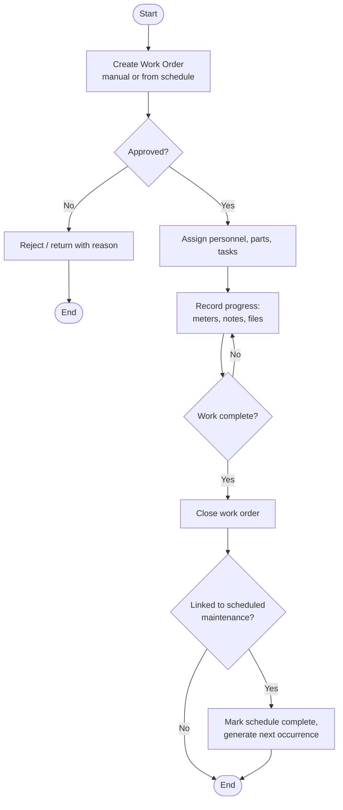
```mermaid
flowchart TD
    Start([Start]) --> W1[Create Work Order<br/>manual or from schedule]
    W1 --> W2{Approved?}
    W2 -- No --> W3[Reject / return with reason] --> End1([End])
    W2 -- Yes --> W4[Assign personnel, parts, tasks]
    W4 --> W5[Record progress:<br/>meters, notes, files]
    W5 --> W6{Work complete?}
    W6 -- No --> W5
    W6 -- Yes --> W7[Close work order]
    W7 --> W8{Linked to scheduled<br/>maintenance?}
    W8 -- Yes --> W9[Mark schedule complete,<br/>generate next occurrence]
    W8 -- No --> End2([End])
    W9 --> End2
```

---

## 7. Technology Stack

| Layer | Previous (legacy) | **Target (this revision)** |
|---|---|---|
| Backend framework | Laravel 10 (PHP 8.1) | **Laravel 13 (PHP 8.3+)** |
| Frontend | Blade + Vue 3 (Laravel Mix), Bootstrap 4, jQuery | **Inertia.js 3 + React 19 + TypeScript**, Tailwind CSS, Vite |
| Database | MySQL (version unspecified) | **MySQL 9.7**, native `GEOMETRY`/spatial types, spatial indexes |
| GIS rendering | Leaflet via Blade/JS | React map component (Leaflet/MapLibre) fed by Inertia props |
| Cache / Queue | Redis | Redis (cache + queue, retained) |
| Telemetry (MQTT/InfluxDB) | Present (energy/solar) | **Removed** — out of scope |
| PDF/Export | barryvdh/laravel-dompdf, maatwebsite/excel | Retained equivalents, now producing Finance/Audit/Disposal reports in addition to Asset/Work Order reports |
| Auth | Laravel session + custom Gate/Role | Laravel session/Sanctum + role/permission-based RBAC, with an added **approval-stage guard** for disposal/deletion |
| Notifications | Not present | Laravel Notifications: SMS / Email / WhatsApp / in-app chat (NFR-12) |
| Testing | PHPUnit 10 | PHPUnit (Laravel 13-compatible), Pest optional, React component tests (Vitest/RTL) for new Inertia pages |

**Compatibility note (NFR-08 successor):** The system targets Laravel 13 + MySQL 9.7 + Inertia 3/React 19/TypeScript going forward. During transition, the legacy ~140-node `categories` nested-set table (columns such as `AssetName`, `CategoryID`, `IsManageInventory`, `expired_on`, `latitude`/`longitude`) is preserved and bridged into the new ISO 55000 `asset_classifications` / `asset_categories` schema via a `legacy_category_id` bridge column, so existing controllers/dropdowns keep functioning until fully migrated (see §8.4).

---

## 8. Database Design

### 8.1 Entity Relationship Overview (Revised)

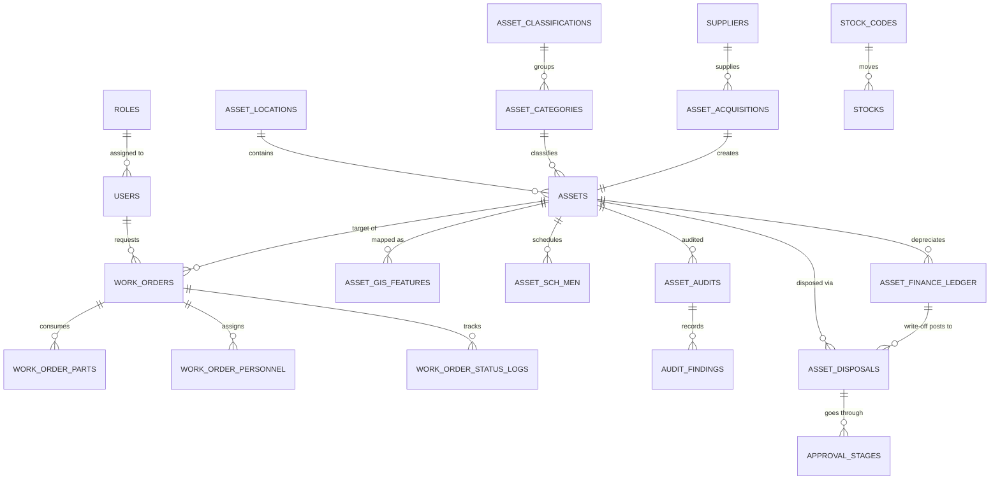
```mermaid
erDiagram
    USERS ||--o{ WORK_ORDERS : requests
    ROLES ||--o{ USERS : "assigned to"
    ASSET_LOCATIONS ||--o{ ASSETS : contains
    ASSET_CLASSIFICATIONS ||--o{ ASSET_CATEGORIES : "groups"
    ASSET_CATEGORIES ||--o{ ASSETS : classifies
    ASSET_ACQUISITIONS ||--|| ASSETS : "creates"
    SUPPLIERS ||--o{ ASSET_ACQUISITIONS : supplies
    ASSETS ||--o{ ASSET_GIS_FEATURES : "mapped as"
    ASSETS ||--o{ WORK_ORDERS : "target of"
    WORK_ORDERS ||--o{ WORK_ORDER_PARTS : consumes
    WORK_ORDERS ||--o{ WORK_ORDER_PERSONNEL : assigns
    WORK_ORDERS ||--o{ WORK_ORDER_STATUS_LOGS : tracks
    ASSETS ||--o{ ASSET_SCH_MEN : schedules
    STOCK_CODES ||--o{ STOCKS : "moves"
    ASSETS ||--o{ ASSET_FINANCE_LEDGER : depreciates
    ASSETS ||--o{ ASSET_AUDITS : audited
    ASSET_AUDITS ||--o{ AUDIT_FINDINGS : records
    ASSETS ||--o{ ASSET_DISPOSALS : "disposed via"
    ASSET_DISPOSALS ||--o{ APPROVAL_STAGES : "goes through"
    ASSET_FINANCE_LEDGER ||--o{ ASSET_DISPOSALS : "write-off posts to"
```

### 8.2 Core Tables (Revised, Removed Modules Excluded)

| Table | Purpose | Status |
|---|---|---|
| `users`, `roles`, `permissions`, `role_user` | Authentication and RBAC | Unchanged |
| `employees`, `events`, `fast_events`, `admin_files` | Admin module support tables | Unchanged |
| `asset_locations` | Facility/GIS-aware location tree (nested-set) | Unchanged |
| `asset_classifications` | ISO 55000 L1–L8 classification tree (nested-set), tagged with `iso_asset_group` | Unchanged |
| `asset_categories` | Structural clone of legacy `categories`, linked via `classification_id` | Unchanged |
| `categories` (legacy) | Legacy ~140-node nested-set category tree | **Retained for compatibility**, bridged via `legacy_category_id` |
| `assets` | Master asset register (ISO 55000 financial & condition fields, `legacy_category_id` bridge, `has_gis_feature`) | Unchanged |
| `asset_gis_features` | Native `GEOMETRY SRID 4326` spatial table, polymorphic to assets/locations | Unchanged |
| **`asset_acquisitions`** | **NEW** — procurement intake: PO number, supplier, delivery date, warranty terms, initial cost | New |
| **`suppliers`** | **NEW** — supplier/contractor master data | New |
| `work_orders`, `work_order_parts`, `work_order_personnel`, `work_order_files`, `work_order_tasks`, `work_order_status_logs`, `work_oredr_meters` | Work order lifecycle and sub-records | Unchanged |
| `schedule_maintenances`, `asset_sch_men`, `task_groups`, `tasks` | Preventive maintenance scheduling | Unchanged |
| `stocks`, `stock_codes` | Stock/spare-parts ledger and reference codes | Unchanged |
| **`asset_finance_ledger`** | **NEW** — per-period CRC, accumulated depreciation, DRC, valuation adjustments | New |
| **`depreciation_methods`** | **NEW** — method (straight-line/reducing-balance), useful-life defaults per ISO classification | New |
| **`asset_audits`** | **NEW** — audit header: scheduled/actual date, auditor, audit type (engineering/financial/compliance) | New |
| **`audit_findings`** | **NEW** — condition score, risk score, notes, recommended action per audited asset | New |
| **`asset_disposals`** | **NEW** — disposal request header: reason, method, proposed date, proceeds | New |
| **`approval_stages`** | **NEW** — generic request → recommendation → approval steps, reused for both deletion (FR-08) and disposal (FR-09/FR-34) | New |

### 8.3 Removed Tables (Out of Scope in This Revision)

The following legacy tables/domains are **decommissioned** along with their controllers and routes: `water_qualities`, `heavy_metals`, `toc_thms`, `wq_church_hills` (Lab); `oprwqs`, `jar_tests`, `chemical_concentration_balances`, `energy_productions`, `power_failures`, `customer_complaints` (Operations); and all MQTT/InfluxDB-derived energy log tables and cache keys (Energy/Telemetry). Any historical data in these tables should be archived/exported before removal, per organizational data-retention policy — this is outside the scope of this DFD revision.

### 8.4 Legacy Compatibility Bridge (carried forward from current implementation)

- The legacy ~140-node `categories` nested-set table and its associated controllers, dropdowns, and views continue to function unchanged during transition.
- A `legacy_category_id` bridge column on `asset_classifications` links the old and new classification trees, allowing gradual, zero-downtime cutover rather than a big-bang migration.
- A migration command converts the legacy tree into the new `asset_classifications` / `asset_categories` tables using an open-ancestor-stack depth algorithm plus keyword-based ISO group guessing (subject to manual review for edge cases).
- A backfill command sets `classification_id` and `has_gis_feature` on existing `assets` rows.
- Legacy column names (`AssetName`, `CategoryID`, `IsManageInventory`, `expired_on`, `latitude`/`longitude`) are preserved on the `assets` table rather than renamed, to avoid breaking existing reports and integrations during transition.

---

## 9. Route Design

### 9.1 Retained Route Groups (Illustrative — Laravel 13 syntax)

```
// Admin
Route::middleware(['auth'])->group(function () {
    Route::resource('admin/users', UserController::class);
    Route::resource('admin/employees', EmployeeController::class);
    Route::resource('admin/events', EventController::class);
});

// Asset Management
Route::resource('assets', AssetController::class);
Route::resource('asset-categories', CategoryController::class);
Route::resource('asset-classifications', ClassificationController::class);
Route::resource('asset-locations', AssetLocationController::class);
Route::get('assets-map', [AssetController::class, 'mapView'])->name('assets.map');

// Work Orders & Maintenance
Route::resource('work-orders', WorkOrderController::class);
Route::post('work-orders/{workOrder}/approve', [WorkOrderController::class, 'approve']);
Route::resource('schedule-maintenance', ScheduleMaintenanceController::class);

// Stock & Materials
Route::resource('stock', StockController::class);
```

### 9.2 New Route Groups (Asset Acquisition, Finance, Audit, Disposal)

```
// Asset Acquisition — NEW
Route::middleware(['auth', 'role:procurement,asset-manager'])->group(function () {
    Route::resource('asset-acquisitions', AssetAcquisitionController::class);
    Route::post('asset-acquisitions/{acquisition}/generate-id', [AssetAcquisitionController::class, 'generateAssetId']);
    Route::post('asset-acquisitions/{acquisition}/generate-qr', [AssetAcquisitionController::class, 'generateQrCode']);
    Route::post('asset-acquisitions/{acquisition}/gis', [AssetAcquisitionController::class, 'storeGisFeature']);
});

// Asset Finance — NEW
Route::middleware(['auth', 'role:finance'])->group(function () {
    Route::get('finance/dashboard', [AssetFinanceController::class, 'dashboard']);
    Route::get('finance/assets/{asset}/ledger', [AssetFinanceController::class, 'ledger']);
    Route::post('finance/depreciation/run', [AssetFinanceController::class, 'runDepreciation']);
    Route::get('finance/export', [FinanceExportController::class, 'export']);
});

// Asset Audit — NEW
Route::middleware(['auth', 'role:risk,quality,asset-manager'])->group(function () {
    Route::resource('asset-audits', AssetAuditController::class);
    Route::post('asset-audits/{audit}/findings', [AuditFindingController::class, 'store']);
    Route::get('asset-audits/export', [AuditExportController::class, 'export']);
});

// Asset Disposal & Deletion (shared approval engine) — NEW
Route::middleware(['auth'])->group(function () {
    Route::post('asset-disposals', [AssetDisposalController::class, 'store'])
        ->middleware('role:asset-manager,maintenance-team');
    Route::post('asset-disposals/{disposal}/recommend', [AssetDisposalController::class, 'recommend'])
        ->middleware('role:engineering,risk');
    Route::post('asset-disposals/{disposal}/approve', [AssetDisposalController::class, 'approve'])
        ->middleware('role:corporate-finance-audit');
    Route::post('assets/{asset}/delete-request', [AssetDeletionController::class, 'requestDeletion']);
});

// Analytics & Reporting
Route::middleware(['auth'])->group(function () {
    Route::get('analytics/dashboard', [AnalyticController::class, 'dashboard']);
    Route::get('reports/asset-condition/{asset}', [AssetConditionPdfController::class, 'download']);
    Route::get('reports/work-order/{workOrder}', [WorkOrderPdfController::class, 'download']);
});
```

### 9.3 Route Design Principles

- Every new module (Acquisition, Finance, Audit, Disposal) is registered as its **own route group with role middleware**, so access boundaries are visible directly in `routes/web.php` rather than only inside controller constructors (addresses a security observation carried over from the prior revision, §11.4).
- Disposal/deletion approval endpoints are **stage-gated**: `recommend` and `approve` each require the actor to hold the role appropriate to that specific stage, enforced by an `EnsureApprovalStage` middleware that checks the current `approval_stages` row for the request.
- All resourceful routes use Laravel 13 class-array/attribute routing (no legacy string-controller routes), resolving LIM-03 from the prior revision.

### 9.4 Explicit Route Removal List

The following route groups (and their controllers) are **removed** in this revision: `/operation/**`, `/oper*` (Operations), `/waterquality/**`, `/labanalysis/**` (Lab), `/BwtpRwInc`, `/energyDisplay*`, `/trends/**`, `/energy-report`, `/enm/**`, `/enmd/**`, `/api/solar/**`, `/grafana` (Energy/Telemetry), and their supporting MQTT/InfluxDB console commands and scheduled jobs.

---

## 10. Business Logic & Workflows

### 10.1 Asset Acquisition Workflow (NEW)

1. Procurement raises a purchase order and, on delivery, creates an **acquisition intake** record capturing supplier, PO reference, delivery date, warranty terms, and invoiced cost.
2. The system generates a **unique utility asset ID** specific to water/wastewater assets (FR-10), following a configurable prefix/sequence scheme (e.g., by asset type + location + sequence).
3. Engineering captures the asset's **GIS geometry** — point (e.g., a pump), linestring (e.g., a pipeline segment), or polygon (e.g., a treatment basin) — according to asset type (FR-11, FR-12), stored with SRID 4326.
4. The system generates a **QR code** encoding the asset ID for mobile lookup (FR-13).
5. The Asset Manager links the asset to its **ISO 55000 classification** and category.
6. On completion, the acquisition record is published to the Asset Register (Process 3.0) and a corresponding **opening entry is created in the Asset Finance ledger** (Process 7.0) using the invoiced cost as the initial CRC.

### 10.2 Asset Management & Work Order Workflow (retained, summarized)

- Assets are organized by ISO 55000 classification (L1–L8) and legacy-compatible categories, located within a nested-set `asset_locations` tree, and optionally mapped via `asset_gis_features`.
- Work orders can be created directly or generated from scheduled preventive maintenance; both paths write to a shared `work_orders` table and a `work_order_status_logs` audit trail.
- Approval, personnel/parts/task assignment, progress recording (meters, notes, files), and closure follow the existing state machine (`WorkOrderStatusID` transitions), unchanged from the current implementation, but now rendered through Inertia/React forms instead of Blade.
- Closing a work order tied to a schedule automatically completes that schedule occurrence and generates the next one, preserving today's recurrence logic.

### 10.3 Asset Financing & Depreciation Workflow (NEW)

1. Each asset's finance ledger opens with an **initial value (CRC)** from acquisition (§10.1) or a manual re-valuation entry.
2. A **depreciation method** (straight-line or reducing-balance) and **useful life** are attached, defaulting from the asset's ISO classification but overridable per asset (supports `expected_life` / RUL already present on legacy `assets` rows).
3. A **monthly scheduled job** iterates all active, non-disposed assets and:
   - Skips assets marked disposed or inactive.
   - Calculates the period's depreciation charge.
   - Updates accumulated depreciation and recalculates **DRC = CRC − Accumulated Depreciation**.
   - Writes an immutable ledger entry for audit traceability.
4. Finance and Executive Management can view current book value, depreciation trends, and export financial charts (PDF/CSV/XLS) at corporate, regional, or site level (FR-32).
5. A **disposal write-off** (Process 9.0) posts a final ledger entry closing the asset's book value to zero (or salvage value) upon disposal execution.

### 10.4 Asset Auditing Workflow (NEW)

1. Audits are scheduled periodically (e.g., annually per classification) or triggered ad-hoc by the Asset Manager or Quality & Compliance team.
2. Engineering performs a **condition assessment** (physical state, performance, defects).
3. The system pulls the asset's current **financial position** (CRC/DRC) from the Finance ledger as audit context.
4. Risk Management applies **risk-based condition scoring** — combining condition, criticality (from ISO classification), and consequence-of-failure weighting — to produce a single risk score per asset.
5. Findings, scores, and recommended actions are recorded against the audit.
6. Assets scoring below a configured risk threshold are automatically flagged on an **at-risk watch-list** and may trigger a recommendation to begin the Asset Disposal workflow (Process 9.0).
7. Audit charts, condition/risk summaries, and exports (PDF/CSV/XLS) are available at corporate, regional, and site level (FR-33).

### 10.5 Asset Disposal & Deletion Workflow (NEW — shared approval engine, FR-08/FR-09/FR-34)

1. **Request:** An Asset Manager or Maintenance Team member submits a disposal (or deletion) request, attaching justification, relevant audit findings, and current asset condition.
2. **Recommendation:** An Engineering/Risk reviewer evaluates the request on technical and risk grounds and either returns it to the requestor with a reason, or forwards it with a recommendation.
3. **Approval:** A **corporate-level Finance & Audit user** gives final sign-off — this single, non-delegable approval stage is enforced identically for both asset deletion (FR-08) and asset disposal (FR-09), per the SRS requirement that both reuse the same controlled workflow.
4. **Execution:** On approval, the disposal method (e.g., scrap, sale, transfer), disposal date, and any proceeds are recorded, and the asset's status is updated to *disposed*.
5. **Financial close-out:** A write-off entry is posted to the Asset Finance ledger, closing the asset's book value.
6. **Retirement:** The asset record is retired/archived (soft-deleted) rather than hard-deleted, preserving historical work order, finance, and audit history for compliance and reporting.

### 10.6 Notifications (NFR-12, cross-cutting)

Automated notifications (SMS, email, WhatsApp, or in-app chat) are dispatched to relevant users when: a work order or PPM schedule is created/updated (existing behavior); an acquisition completes and needs classification (new); a depreciation run completes (new); an audit is due or flags an at-risk asset (new); and at each stage transition of a disposal/deletion request (new) — replacing informal manual communication per SRS §3.

### 10.7 Analytics & Reporting Workflow (retained, expanded data sources)

`AnalyticController` and its export/PDF counterparts now aggregate across **Assets, Work Orders, Stock, Asset Finance, and Asset Audit** data stores (no longer Operations/Lab/Energy), producing engineering, cost, risk, and financial dashboards, charts, and PDF/CSV/XLS exports for management review (FR-31).

---

## 11. Security Design

### 11.1 Authentication

- Session-based (and, where applicable, Sanctum token-based for SPA/API calls) authentication.
- `User` model supports soft deletes, so accounts can be deactivated without losing referential history (work orders, acquisitions, finance ledger entries, audits, and disposals continue to resolve historical user references via `withTrashed()`).
- Passwords hashed via Laravel's `Hash` facade.

### 11.2 Authorization Model (Role-Based Access Control)

A single, consolidated RBAC system (superseding the previous dual custom-Gate / unused-package situation) drives all access checks:

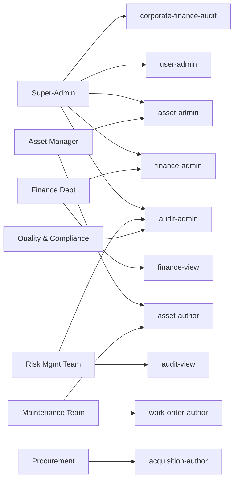
```mermaid
flowchart LR
    SuperAdmin["Super-Admin"] --> G1["user-admin"]
    SuperAdmin --> G2["asset-admin"]
    SuperAdmin --> G3["finance-admin"]
    SuperAdmin --> G4["audit-admin"]
    SuperAdmin --> G5["corporate-finance-audit"]

    AssetMgrRole["Asset Manager"] --> G2
    AssetMgrRole --> G6["asset-author"]
    MaintRole["Maintenance Team"] --> G6
    MaintRole --> G7["work-order-author"]

    FinanceRole["Finance Dept"] --> G3
    FinanceRole --> G8["finance-view"]

    RiskRole["Risk Mgmt Team"] --> G4
    QualityRole["Quality & Compliance"] --> G4
    RiskRole --> G9["audit-view"]

    ProcurementRole["Procurement"] --> G10["acquisition-author"]
```

- Roles map to organizational level scope (**corporate / regional / site**) as well as functional gates, so a user's permitted data set is filtered both by *what* they can do and *where* (which locations/regions) they can do it.
- The **final disposal/deletion approval** (`corporate-finance-audit` gate) is intentionally restricted to a small, corporate-level group, matching FR-08/FR-09.

### 11.3 Middleware-Based Protections

| Middleware | Purpose | Applied to |
|---|---|---|
| `auth` | Requires an authenticated session | All application routes |
| `role:*` | Requires one or more named roles | Acquisition, Finance, Audit, Disposal route groups (§9.2) |
| `EnsureApprovalStage` | Ensures the acting user matches the current stage (request/recommend/approve) of a disposal or deletion record | `asset-disposals/*` |
| `EnsureOrgLevelScope` | Filters queries/actions to the user's corporate/regional/site scope | Asset, Finance, Audit dashboards and exports |
| `VerifyCsrfToken` | CSRF protection on state-changing requests | All web routes |
| `ThrottleRequests` | Rate limiting | API/Inertia data-fetch routes |

### 11.4 Security Observations & Recommendations (carried forward and updated)

| Observation | Risk | Recommendation |
|---|---|---|
| Legacy custom-Gate system alongside a formal RBAC package | Confusing, risk of inconsistent enforcement | Standardize fully on the RBAC package described in §11.2; retire the legacy Gate closures |
| Multi-stage approval workflow (disposal/deletion) must not be bypassable by direct route/API calls | High — financial and compliance impact | Enforce `EnsureApprovalStage` server-side on every mutating endpoint, never trust client-side stage display alone |
| Legacy `categories` table and bridge column (§8.4) increase schema surface area during transition | Moderate — two sources of truth temporarily | Track a hard cutover date; monitor `legacy_category_id` usage and retire once all consumers migrate |
| GIS/spatial data (locations of critical infrastructure) is sensitive | Moderate | Scope map/GIS endpoints by org-level and role; avoid exposing precise coordinates of sensitive facilities to unauthenticated or low-privilege users |
| Financial ledger and audit findings are sensitive/compliance-relevant | High | Ledger entries and audit findings should be append-only/immutable at the application layer, with corrections recorded as new entries, not edits |
| CSRF is on by default via Laravel's `web` middleware group | — | No action needed; verify Inertia POST/PUT/DELETE requests include the token (handled automatically by Inertia's Axios adapter) |

---

## 12. Testing Strategy

### 12.1 Recommended Test Pyramid

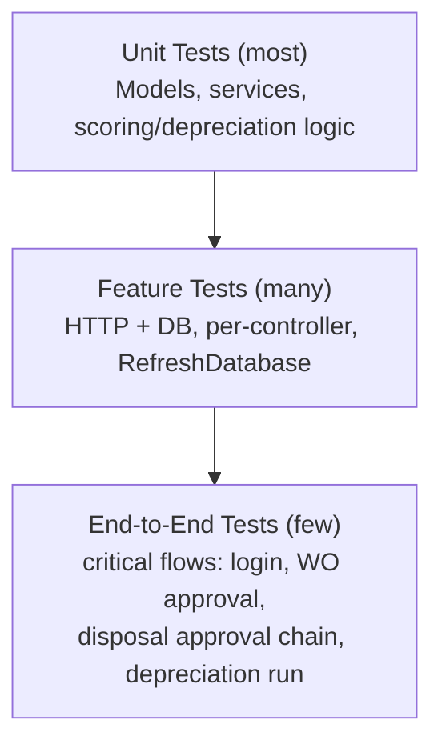
```mermaid
flowchart TB
    E2E["End-to-End Tests (few)<br/>critical flows: login, WO approval,<br/>disposal approval chain, depreciation run"]
    Feature["Feature Tests (many)<br/>HTTP + DB, per-controller, RefreshDatabase"]
    Unit["Unit Tests (most)<br/>Models, services, scoring/depreciation logic"]

    Unit --> Feature --> E2E
```

### 12.2 Recommended Coverage by Module

| Module | Suggested test focus | Test type |
|---|---|---|
| Authentication / RBAC | Login, role/permission gates return correct booleans per role combination, org-level scoping | Feature + Unit |
| Asset Acquisition (NEW) | Unique asset ID generation is collision-free; QR code encodes correct asset ID; GIS geometry persists correctly by asset type | Feature + Unit |
| Asset Management | Classification tree (nested-set) integrity; legacy bridge (`legacy_category_id`) resolves correctly | Feature |
| Work Order lifecycle | Create → correct ID/code sequence; Approve → status + log; Reject → status + log; schedule conversion | Feature |
| Stock/Parts | Adding a part references correct stock code; external part validated via Form Request | Feature |
| **Asset Finance (NEW)** | Depreciation calculation correctness (straight-line and reducing-balance); DRC = CRC − Accum. Dep.; scheduled job idempotency (does not double-depreciate on re-run) | Unit + Feature |
| **Asset Audit (NEW)** | Condition/risk scoring formula correctness; at-risk threshold flagging; audit-to-disposal recommendation trigger | Unit + Feature |
| **Asset Disposal (NEW)** | Full request → recommendation → approval chain enforces stage-correct roles; rejection returns to requestor; approval posts write-off and retires asset | Feature |
| Analytics/Reporting | Dashboard, chart, and export data remain consistent with underlying Asset/Finance/Audit/Work Order records | Feature |
| PDF/Export controllers | Correct HTTP response type/headers for generated PDFs and CSV/XLS files (Asset, Finance, Audit, Disposal, Work Order) | Feature |

### 12.3 Practical Recommendations

1. Commit and maintain Laravel migrations for all new tables (§8.2) so `RefreshDatabase`-based feature tests run against a reproducible schema.
2. Seed minimal reference data (roles, ISO classifications, depreciation methods, work order statuses) via factories/seeders.
3. Prioritize the **Asset Disposal approval chain** and **Depreciation engine** first — these are the highest financial/compliance-risk paths introduced in this revision.
4. Add React/TypeScript component tests (Vitest + React Testing Library) for new Inertia pages, especially multi-step forms (acquisition intake, disposal request).
5. Add CI (e.g., GitHub Actions) running `php artisan test` and the frontend test suite on every push/PR.

---

## 13. Summary

This revision re-scopes the platform into a focused **ISO 55000-aligned Asset Management / CMMS system**, removing Plant & Operations, Lab Water Quality, and Energy/Telemetry entirely, and adding four new first-class functional areas — **Asset Acquisition, Asset Financing, Asset Auditing, and Asset Disposal** — each fully represented from the context diagram down through Level 2 DFDs, data stores, routes, business rules, and security roles. The target technology stack moves to **Laravel 13, MySQL 9.7, and Inertia.js 3 + React 19 + TypeScript**, while explicitly preserving the legacy `categories` nested-set table and its bridge column so existing controllers and data continue to function during transition. The disposal and deletion workflows share a single, auditable **request → recommendation → corporate-approval** engine, and the new Finance and Audit modules are wired directly into Analytics & Reporting so that engineering, cost, risk, and compliance data can be viewed together at corporate, regional, and site level — directly fulfilling FR-08, FR-09, and FR-31–FR-34 of the finalized SRS.